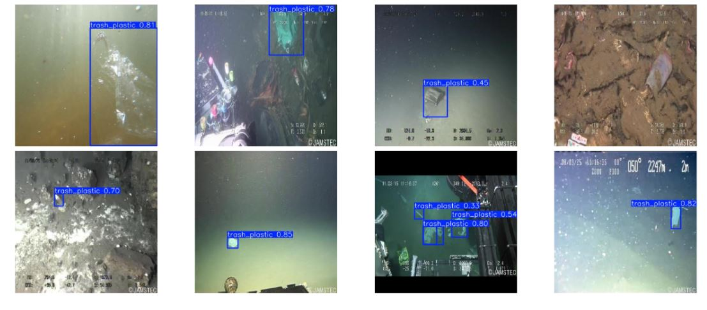

### Проект в рамках Хакатона МИФИ 2024

**Выполнила проект команда №11:**

- Бебнев Константин Сергеевич
- Горбуля Андрей Владимирович
- Давлатзода Бузургмехр
- Ефимов Денис Дмитриевич

**Цель проекта** — Разработать модель, которая будет выполнять одну из задач мониторинг экосистемы. Выбрана тема детекции пластика в мировом океане.

**Постановка задачи:** Найти походящий датасет с пластиковым мусором, выбрать подходящую модель и дообучить ее на выбранном датасете. 

**Источники данных:**

- **Датасет:** [https://www.robots.ox.ac.uk/~vgg/software/via/via-1.0.6.html](https://universe.roboflow.com/deepplastic/marine-plastic)
- **Модель:** **модель YOLO 11** [https://pytorch.org/vision/master/models/faster_rcnn.html](https://github.com/ultralytics/ultralytics)

**Структура данных**

- hackaton-mifi.ipynb - блокнот для обучения модели.
- predict - хранит примеры работы модели на тестовых данных.
- Presentation- Презентация с описанием результатов и выводы.

**Пример использования**

Результат на тестовых данных:

